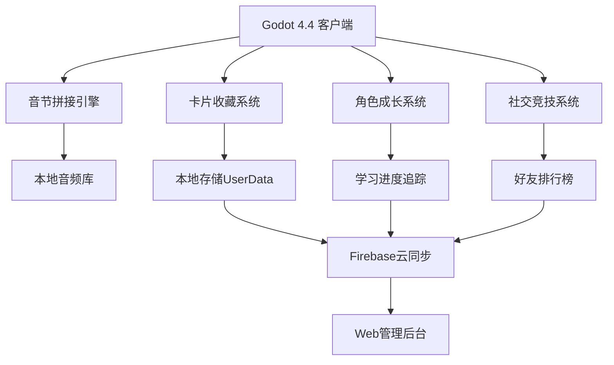

LexiLink 2.0: 开发计划书

## 一、技术选型重构

| 模块 | 技术方案 | 优势 |
|------|----------|------|
| 游戏引擎 | **Godot 4.4** | 🚀 极简开发/优秀2D性能/免费开源 |
| 音频处理 | Godot内置AudioStream | 🎵 原生支持/低延迟/跨平台兼容 |
| 数据存储 | Godot UserData + JSON | 💾 轻量级/离线优先/隐私安全 |
| 云端同步 | Firebase Firestore | ☁️ 实时同步/免运维/社交功能支持 |
| 跨平台部署 | Godot Export Templates | 📱 一键发布iOS/Android/Web/Desktop |

## 二、简化系统架构



**架构原则：**
- 🎯 **离线优先**：核心游戏功能无需网络
- ⚡ **快速响应**：本地数据避免网络延迟
- 🔒 **隐私保护**：用户数据最小化收集
- 🌐 **社交增强**：云端同步支持多人互动

## 三、开发里程碑规划

### 🚀 Phase 1: MVP核心系统（4周）

**Week 1-2: 基础框架搭建**
```
□ Godot项目初始化 + Git仓库搭建
□ 极简UI系统（迷你地铁风格）
□ 音节卡片拖拽机制
□ 基础音频播放系统
□ 核心数据结构设计
□ 用户注册登录系统
```

**Week 3-4: 游戏机制实现**
```
□ 语言探险家角色系统
□ 4个主题世界场景搭建
□ 音节连接验证逻辑
□ 卡片收藏系统基础版
□ 关卡进度保存机制
□ 基础成就系统
```

### 🎮 Phase 2: 游戏体验优化（3周）

**Week 5-6: 交互体验优化**
```
□ 多设备适配（手机/平板/桌面）
□ 智能容错机制实现
□ 角色动画与反馈系统
□ 音效设计与集成
□ 游戏引导教程系统
□ 设置面板（音量、语言等）
```

**Week 7: 肉鸽机制实现**
```
□ 随机关卡生成器
□ 特殊事件系统（语音精灵等）
□ Boss挑战关卡设计
□ 路径选择界面
□ 高级游戏模式（速度/完美/无尽）
```

### 📱 Phase 3: 社交与发布（3周）

**Week 8: 社交系统开发**
```
□ 好友系统（添加/管理）
□ 排行榜系统（多维度排名）
□ 卡片交换功能
□ 用户个人资料页
□ 成就分享机制
```

**Week 9-10: 平台优化与发布**
```
□ iOS/Android/Web全平台适配
□ 性能优化（低端设备支持）
□ 应用图标 + 启动屏设计
□ 应用商店资源准备
□ 用户测试与反馈收集
□ 首版发布（多平台同步）
```

## 四、核心模块技术实现

### 1. 通用拖拽系统
```gdscript
# 跨设备友好的拖拽控制器
extends Control
class_name UniversalDragController

@export var min_drag_distance: float = 15.0
@export var snap_distance: float = 60.0
@export var touch_scale_factor: float = 1.2  # 移动设备放大

func _input(event):
    if event is InputEventScreenDrag or event is InputEventMouseMotion:
        handle_drag_motion(event)
    elif (event is InputEventScreenTouch and not event.pressed) or \
         (event is InputEventMouseButton and not event.pressed):
        handle_drag_release(event)

func handle_drag_motion(event):
    if dragging_syllable:
        dragging_syllable.global_position = get_adjusted_position(event.position)
        update_connection_preview()
        
        # 触觉反馈（移动设备）
        if OS.has_feature("mobile"):
            Input.vibrate_handheld(50)

func get_adjusted_position(raw_pos: Vector2) -> Vector2:
    # 根据设备类型调整拖拽灵敏度
    if OS.has_feature("mobile"):
        return raw_pos * touch_scale_factor
    return raw_pos
```

### 2. 极简视觉系统增强
```gdscript
# 迷你地铁风格渲染器（支持多分辨率）
extends Node2D
class_name ResponsiveMinimalRenderer

const COLORS = {
    "consonant": Color("#E74C3C"),
    "vowel": Color("#3498DB"),
    "complete": Color("#2ECC71"),
    "background": Color("#F8F9FA"),
    "accent": Color("#F39C12")
}

@export var base_card_size := Vector2(120, 80)
@export var font_size_base := 18

func _ready():
    # 根据屏幕尺寸自适应
    var scale_factor = get_viewport().get_visible_rect().size.x / 1080.0
    base_card_size *= scale_factor
    font_size_base = int(font_size_base * scale_factor)

func draw_syllable_card(syllable_data: SyllableData, pos: Vector2):
    var rect = Rect2(pos, base_card_size)
    var color = COLORS[syllable_data.type]
    
    # 卡片主体
    draw_rect(rect, color, true)
    draw_rect(rect, color.darkened(0.2), false, 2)
    
    # 响应式字体
    var font = preload("res://fonts/inter_bold.ttf")
    var text_pos = pos + base_card_size * 0.5
    draw_string(font, text_pos, syllable_data.text, 
               ALIGN_CENTER, -1, font_size_base, Color.WHITE)

func create_connection_animation(from: Vector2, to: Vector2):
    var tween = create_tween()
    tween.set_ease(Tween.EASE_OUT)
    tween.set_trans(Tween.TRANS_CUBIC)
    
    # 平滑的连接线动画
    tween.tween_method(draw_animated_line, 0.0, 1.0, 0.5)

func draw_animated_line(progress: float):
    # 贝塞尔曲线连接动画
    queue_redraw()
```

### 3. 社交系统核心
```gdscript
# 好友与排行榜系统
extends Node
class_name SocialSystem

signal friend_request_received(user_data)
signal leaderboard_updated(rankings)

var current_user: UserProfile
var friends_list: Array[UserProfile] = []
var pending_requests: Array[UserProfile] = []

func add_friend_by_id(user_id: String):
    var friend_data = await Firebase.get_user_profile(user_id)
    if friend_data:
        send_friend_request(friend_data)

func send_friend_request(target_user: UserProfile):
    var request_data = {
        "from_user": current_user.to_dict(),
        "timestamp": Time.get_unix_time_from_system(),
        "message": "想和你一起学习英语！"
    }
    
    await Firebase.send_friend_request(target_user.user_id, request_data)
    show_notification("好友请求已发送")

func update_leaderboard():
    var my_score = current_user.get_weekly_score()
    var friends_scores = []
    
    for friend in friends_list:
        friends_scores.append({
            "user": friend,
            "score": friend.get_weekly_score()
        })
    
    # 排序并发出信号
    friends_scores.sort_custom(func(a, b): return a.score > b.score)
    leaderboard_updated.emit(friends_scores)

func create_challenge(friend: UserProfile, challenge_type: String):
    var challenge_data = {
        "challenger": current_user.user_id,
        "challenged": friend.user_id,
        "type": challenge_type,
        "created_at": Time.get_unix_time_from_system(),
        "status": "pending"
    }
    
    await Firebase.create_challenge(challenge_data)
```

### 4. 学习分析系统
```gdscript
# 学习数据分析（非侵入式）
extends Node
class_name LearningAnalytics

var session_data = {}
var learning_patterns = {}

func track_learning_session(syllable: String, is_correct: bool, response_time: float):
    # 记录学习数据（仅本地）
    if not learning_patterns.has(syllable):
        learning_patterns[syllable] = LearningPattern.new()
    
    var pattern = learning_patterns[syllable]
    pattern.add_attempt(is_correct, response_time)
    
    # 实时反馈优化
    if is_correct:
        show_success_feedback(calculate_mastery_level(pattern))
    else:
        suggest_learning_strategy(syllable, pattern)

func generate_weekly_report() -> Dictionary:
    return {
        "total_time": calculate_total_learning_time(),
        "accuracy_trend": calculate_accuracy_trend(),
        "mastered_syllables": get_mastered_syllables(),
        "improvement_areas": identify_weak_areas(),
        "achievements_unlocked": get_new_achievements(),
        "next_goals": suggest_next_learning_goals()
    }

func calculate_mastery_level(pattern: LearningPattern) -> float:
    # 基于多个因素计算掌握度
    var accuracy = pattern.get_accuracy()
    var consistency = pattern.get_consistency()
    var speed_improvement = pattern.get_speed_trend()
    
    return (accuracy * 0.5 + consistency * 0.3 + speed_improvement * 0.2)

func suggest_next_learning_goals() -> Array[String]:
    var suggestions = []
    var weak_areas = identify_weak_areas()
    
    for area in weak_areas:
        match area:
            "vowel_sounds":
                suggestions.append("专注练习双元音组合")
            "consonant_clusters":
                suggestions.append("加强辅音丛拼接练习")
            "connected_speech":
                suggestions.append("尝试连读挑战模式")
    
    return suggestions
```

## 五、资源与内容规划

### 音频资源库（扩展版）
```
完整音节库（500个）：
├── 单音节词汇：cat, dog, sun, work... (150个)
├── 双音节常用词：happy, table, become... (200个)  
├── 多音节词汇：beautiful, important... (100个)
├── 连读示例：could you, want to... (50个)
└── 录制标准：
    ✓ 美式发音（自然语速）
    ✓ 22kHz采样率（高质量音频）
    ✓ 动态音量处理
    ✓ 多语音人选择（男/女声）

语言扩展包：
├── 英式发音包（可选切换）
├── 专业词汇包（商务/学术）
├── 俚语习语包（日常表达）
└── 未来扩展：日语、韩语音节
```

### 视觉资源设计（全设备适配）
```
多分辨率UI资源：
├── 角色动画：Lexi表情动作（40个状态）
├── 世界背景：4个主题场景（矢量设计）
├── UI组件库：按钮、卡片、图标（可缩放）
├── 特效动画：成功、失败、升级效果
└── 多设备适配：
    ✓ 手机竖屏（9:16）
    ✓ 手机横屏（16:9）
    ✓ 平板（4:3）
    ✓ 桌面（任意比例）
```

## 六、测试与验证策略

### 多用户群体测试
```
测试用户分组：
🎓 英语初学者：在校学生、职场新人（20人）
👨‍💼 中级学习者：有基础但需提升发音（15人）
🎮 游戏爱好者：关注游戏体验和趣味性（10人）

核心测试指标：
📊 操作流畅度：>90%（跨设备兼容性）
⏱️ 单次游戏时长：15-30分钟（用户粘性）
😊 用户满意度：>4.5分（App Store评分目标）
🎯 学习留存率：7日留存>35%（教育效果）
🤝 社交参与度：好友互动>60%（社交功能验证）

A/B测试计划：
🎨 UI风格测试：极简vs丰富视觉
🎵 音频反馈：即时vs延迟播放
🏆 奖励机制：卡片vs积分vs排名
📱 社交功能：强制vs可选好友系统
```

## 七、风险控制与应对

| 风险类型 | 概率 | 影响 | 应对方案 |
|----------|------|------|----------|
| **技术风险** | | | |
| Godot 4.4兼容性问题 | 中 | 高 | 维护Godot 4.3备用版本 |
| 跨平台性能差异 | 中 | 中 | 分设备优化+降级方案 |
| 云服务依赖风险 | 低 | 中 | 离线模式+多云备份 |
| **市场风险** | | | |
| 用户接受度不高 | 中 | 高 | 强化免费体验+社区运营 |
| 竞品快速模仿 | 高 | 中 | 专注用户体验差异化+快速迭代 |
| 变现模式失效 | 中 | 高 | 多元化收入来源+数据驱动调整 |
| **合规风险** | | | |
| 用户隐私合规 | 低 | 高 | GDPR合规+数据最小化原则 |
| 内容审核压力 | 中 | 中 | 预设内容库+AI+人工审核 |
| 跨国运营风险 | 中 | 中 | 分地区合规策略 |

## 八、团队配置与预算

### 核心开发团队（4人）
```
👨‍💻 Godot主程序员：
    ✓ GDScript专精 + 游戏机制设计
    ✓ 跨平台发布经验
    ✓ 薪资预算：¥18,000/月

🎨 UI/UX设计师：
    ✓ 游戏UI设计经验
    ✓ 极简风格设计能力  
    ✓ 薪资预算：¥14,000/月

🔧 后端开发工程师：
    ✓ Firebase/云服务集成
    ✓ API设计与开发
    ✓ 薪资预算：¥16,000/月

🎵 音频内容制作：
    ✓ 英语教学背景
    ✓ 多语音录制处理
    ✓ 外包预算：¥15,000（一次性）
```

### 完整投入预算
```
开发成本（4个月）：
├── 人力成本：(18,000 + 14,000 + 16,000) × 4 = ¥192,000
├── 音频制作：¥15,000
├── 云服务费用：Firebase ¥3,000/月 × 4 = ¥12,000
├── 开发工具：设计软件+其他工具 ¥5,000
├── 应用商店费用：iOS ¥688 + Android ¥168 = ¥856
└── 总计：¥224,856

首年运营预算：
├── 云服务扩容：¥36,000（¥3,000/月）
├── 市场推广：¥80,000
├── 内容更新：¥40,000
├── 客服支持：¥24,000
├── 版权音乐：¥8,000
└── 总计：¥188,000

投资回报预期：
├── 目标付费用户：20,000人
├── 平均客单价：¥150/年
├── 年收入预期：¥3,000,000
├── 毛利润：¥2,500,000（扣除分发费用）
└── ROI：6倍+（第二年开始显著盈利）
```

## 九、发布与推广策略

### 多平台发布计划
```
🤖 Android先行（第10周）：
    ✓ Google Play教育类别
    ✓ 快速迭代收集反馈
    ✓ 本地化适配测试

📱 iOS同步（第10周）：
    ✓ App Store教育类别
    ✓ 苹果官方推荐申请
    ✓ iPad专项优化

🌐 Web版本（第12周）：
    ✓ PWA离线支持
    ✓ 社交媒体分享便利
    ✓ 试用体验入口

💻 桌面版本（第14周）：
    ✓ Steam教育标签
    ✓ 企业培训市场
    ✓ 大屏幕优化体验
```

### 用户获取策略
```
有机增长：
📱 ASO优化：关键词"英语学习"、"发音游戏"
📝 内容营销：学习方法文章+视频
🎥 社交媒体：TikTok/小红书学习挑战
👥 社区运营：英语学习者QQ群/微信群

付费推广：
🎯 精准投放：英语学习app用户再营销
📺 视频广告：YouTube教育频道合作
🤝 KOL合作：英语教师/学习博主推荐
🏢 B端合作：企业培训机构合作

病毒传播：
🎁 邀请奖励：推荐好友获得稀有卡片
📸 成就炫耀：学习成果社交分享
🏆 挑战赛事：定期举办全网竞赛
📱 UGC激励：用户创作内容奖励
```

## 十、成功指标与里程碑

### 产品验证指标（6个月内）
- ✅ **用户规模**：月活用户>100,000
- ✅ **用户留存**：次日留存>45%，月留存>15%
- ✅ **学习效果**：单词掌握率>80%（2周后测试）
- ✅ **用户满意度**：应用商店评分>4.3分
- ✅ **社交活跃度**：用户日均好友互动>2次

### 商业化指标（12个月内）
- 💰 **付费转化**：免费用户转付费>12%
- 📈 **收入增长**：月收入>¥200,000
- 🔄 **用户LTV**：生命周期价值>¥180
- 👥 **用户推荐**：NPS评分>50
- 🌍 **市场渗透**：教育类App排名TOP20

### 技术稳定性指标
- 🔧 **系统稳定性**：崩溃率<0.3%
- ⚡ **响应速度**：应用启动<3秒
- 💾 **资源优化**：安装包<100MB
- 🔒 **安全合规**：零安全事故

**核心开发理念：** 以用户学习效果为中心，通过Godot 4.4的技术优势和极简游戏化设计，打造既有教育价值又具备强社交属性的音节学习平台。

**市场定位：** 首款将语音学习与肉鸽游戏完美结合的产品，面向成人英语学习市场，通过收藏卡片和社交竞技激发持续学习动力。
