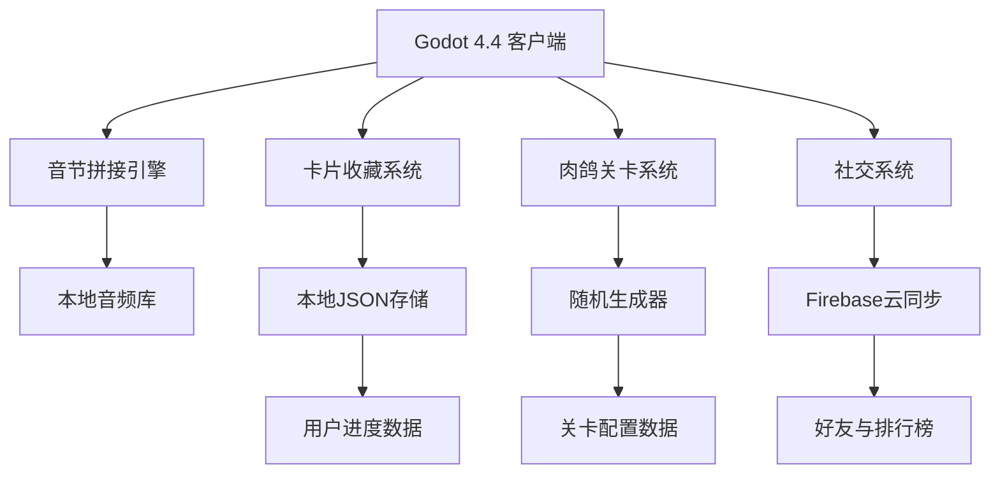

# LexiLink MVP 开发计划书 v1.0

## 📋 项目概述

**项目名称**: LexiLink - 音节拼接英语学习游戏  
**项目类型**: 休闲教育类移动/Web游戏  
**技术栈**: Godot 4.4 + Firebase  
**开发周期**: 21天 MVP + 后续迭代  
**目标用户**: 成人英语学习者  

## 🎯 产品核心

### 核心玩法
- **音节拼接**: 拖拽音节卡片组成完整单词
- **语言探险家**: 角色Lexi在被"语言诅咒"封印的世界冒险
- **肉鸽机制**: 随机路线、音节池、特殊事件、Boss挑战
- **卡片收藏**: 五个稀有度等级，100%正确获得卡片
- **社交竞技**: 好友系统、排行榜、挑战对决

### 世界观设定
- **音节新手村**: 基础CVC音节练习
- **双音节森林**: 常用双音节词汇  
- **高阶语音山脉**: 复杂音节组合
- **语言大师殿堂**: 终极挑战区域

## 🛠 技术架构

### 技术选型
| 模块 | 技术方案 | 理由 |
|------|----------|------|
| 游戏引擎 | Godot 4.4 | 快速开发、优秀2D性能、免费开源 |
| 音频处理 | Godot AudioStream | 原生支持、低延迟、跨平台兼容 |
| 数据存储 | 本地JSON + UserData | 离线优先、隐私安全、快速访问 |
| 云端服务 | Firebase Firestore | 免费额度、实时同步、社交功能 |
| 部署方式 | Vercel + Godot Web | 零成本部署、全球CDN、快速访问 |

### 系统架构图


## 📅 21天开发计划

### 第一周：核心框架 + 肉鸽机制 (Day 1-7)

**Day 1: 项目搭建**
- [ ] Godot 4.4项目初始化
- [ ] Git仓库建立(.gitignore配置)
- [ ] 项目目录结构创建
- [ ] 编码规范.mdc文件创建
- [ ] CI/CD流程配置

**Day 2: 数据结构设计**
- [ ] 音节数据结构定义
- [ ] 卡片系统数据模型
- [ ] 用户进度数据结构
- [ ] 静态数据管理器
- [ ] 基础UI组件库

**Day 3: 肉鸽核心机制**
- [ ] 随机关卡生成器
- [ ] 路径选择系统
- [ ] 事件系统框架
- [ ] Boss挑战机制
- [ ] 难度自适应算法

**Day 4: 音节拖拽系统**
- [ ] 跨设备拖拽控制器
- [ ] 音节连接验证
- [ ] 实时音频反馈
- [ ] 视觉连接效果
- [ ] 错误处理机制

**Day 5: UI界面开发**
- [ ] 主菜单界面
- [ ] 游戏场景UI
- [ ] 迷你地铁风格设计
- [ ] 响应式布局系统
- [ ] 多分辨率适配

**Day 6-7: 系统整合测试**
- [ ] 模块集成测试
- [ ] 基础游戏流程验证
- [ ] 性能优化
- [ ] 第一次部署到Vercel
- [ ] 内部测试反馈收集

### 第二周：卡片系统 + 学习体验 (Day 8-14)

**Day 8: 卡片收藏系统**
- [ ] 五级稀有度系统
- [ ] 卡片获取逻辑
- [ ] 收藏册界面
- [ ] 卡片展示动画
- [ ] 成就系统基础

**Day 9: 学习进度追踪**
- [ ] 用户学习数据分析
- [ ] 自适应难度调节
- [ ] 学习报告生成
- [ ] 进度可视化
- [ ] 个性化推荐

**Day 10: 音频系统优化**
- [ ] 多语音支持
- [ ] 音频质量优化
- [ ] 语音反馈系统
- [ ] 音效设计集成
- [ ] 音频预加载优化

**Day 11: 性能与安全**
- [ ] 内存管理优化
- [ ] 资源异步加载
- [ ] 数据加密存储
- [ ] 错误处理完善
- [ ] 崩溃报告系统

**Day 12: 多平台适配**
- [ ] 移动设备优化
- [ ] 桌面版本适配
- [ ] 触控与鼠标统一
- [ ] 不同屏幕尺寸测试
- [ ] 兼容性验证

**Day 13-14: 系统测试**
- [ ] 完整功能测试
- [ ] 用户体验测试
- [ ] 性能压力测试
- [ ] Bug修复与优化
- [ ] 第二次部署更新

### 第三周：抛光 + 测试 + 发布 (Day 15-21)

**Day 15: UI/UX 抛光**
- [ ] 视觉效果优化
- [ ] 动画流畅度提升
- [ ] 无障碍功能添加
- [ ] 用户引导优化
- [ ] 界面一致性检查

**Day 16: 内容完善**
- [ ] 音节库内容扩充
- [ ] 帮助文档编写
- [ ] 游戏教程完善
- [ ] 多语言支持准备
- [ ] 版权信息整理

**Day 17: 测试用户招募**
- [ ] 测试用户招募(30人)
- [ ] 反馈收集工具集成
- [ ] 实时监控面板搭建
- [ ] 问题反馈机制
- [ ] 用户行为分析

**Day 18-19: 用户测试期**
- [ ] 持续监控用户反馈
- [ ] 快速bug修复
- [ ] 用户体验优化
- [ ] 性能问题解决
- [ ] 功能微调

**Day 20-21: 正式发布**
- [ ] 最终版本打包
- [ ] 部署到生产环境
- [ ] 监控系统启动
- [ ] 发布公告准备
- [ ] 用户支持准备

## 🎨 设计规范

### 视觉风格
- **主题**: 极简美学，参考《迷你地铁》
- **配色**: 柔和蓝绿色系，护眼友好
- **字体**: Inter/思源黑体，清晰易读
- **动画**: 流畅平滑，符合Material Design
- **响应式**: 支持手机/平板/桌面多尺寸

### 音频标准
- **格式**: OGG Vorbis (Godot推荐)
- **采样率**: 22kHz (平衡质量与大小)
- **声道**: 单声道(语音) / 立体声(音效)
- **音量**: 统一响度标准，避免音量跳跃
- **压缩**: 适度压缩，保证清晰度

## 🔧 开发规范与 CI/CD

### 代码规范 (详见 coding_standards.mdc)
- **GDScript规范**: 遵循Godot官方Style Guide
- **命名规则**: snake_case变量，PascalCase类名
- **注释标准**: 中英文混合，关键逻辑必须注释
- **代码审查**: 每个PR必须经过Review
- **测试覆盖**: 核心逻辑100%测试覆盖

### Git 工作流
```bash
# 主分支策略
main          # 生产分支，只接受hotfix和release merge
develop       # 开发主分支，所有feature最终合并目标
feature/*     # 功能分支，从develop创建
hotfix/*      # 紧急修复分支，从main创建
release/*     # 发布分支，从develop创建用于发布准备

# 提交规范
feat: 新功能开发
fix: bug修复  
docs: 文档更新
style: 代码格式调整
refactor: 代码重构
test: 测试相关
chore: 构建工具、依赖更新
```

### 自动化 CI/CD 流程
```yaml
# 每次commit自动执行
1. 代码静态检查 (GDScript Lint)
2. 自动化测试运行
3. 构建验证
4. 部署到测试环境

# 每日定时任务
1. 自动commit本地更改
2. 整合当天多个commit (git rebase)
3. 推送到远程仓库
4. 生成每日构建报告

# 发布流程
1. 创建release分支
2. 自动化测试完整套件
3. 多平台构建 (Web/Android/Desktop)
4. 部署到生产环境
5. 版本标签创建
```

### 开发环境配置
```bash
# 必需工具
- Godot 4.4 (稳定版)
- Git 2.30+
- Node.js 18+ (用于部署脚本)
- VS Code + Godot Tools插件
- Android Studio (移动版发布)

# 可选工具  
- Figma (UI设计)
- Audacity (音频处理)
- GitHub Desktop (Git可视化)
- Postman (API测试)
```

## 📊 成功指标

### 技术指标
- [ ] 页面加载时间 < 3秒
- [ ] 无严重崩溃 (Crash率 < 0.1%)
- [ ] 跨设备兼容性 > 95%
- [ ] 代码测试覆盖率 > 80%
- [ ] 首次游戏完成率 > 60%

### 用户体验指标
- [ ] 平均游戏时长 > 15分钟
- [ ] 用户重玩率 > 70%
- [ ] 用户满意度 > 7分(10分制)
- [ ] 学习效果感知 > 70%
- [ ] 推荐意愿 > 60%

### 业务指标 (后续关注)
- [ ] 日活跃用户增长
- [ ] 用户留存率监控
- [ ] 社交功能使用率
- [ ] 用户反馈响应时间
- [ ] 功能使用热力图

## 💰 成本控制

### 开发阶段 (MVP)
- **人力成本**: 独立开发者 (0成本)
- **工具成本**: 免费开源工具
- **服务成本**: Firebase免费额度 + Vercel免费部署
- **总成本**: 接近0元 (仅域名等小额费用)

### 运营阶段 (用户增长后)
- **云服务扩容**: Firebase按量付费
- **CDN加速**: Vercel Pro计划
- **监控服务**: 免费额度 + 付费增强
- **预估月成本**: < ¥500 (1000活跃用户内)

## 🚀 发布策略

### 阶段性发布
1. **Alpha版本** (Day 14): 内部测试，核心功能验证
2. **Beta版本** (Day 18): 小规模用户测试(30人)
3. **MVP发布** (Day 21): 公开发布，收集真实用户反馈
4. **迭代优化** (Day 22+): 基于反馈快速迭代

### 平台优先级
1. **Web版本**: 最快部署，易于分享和测试
2. **Android版本**: 用户基数大，发布门槛低
3. **iOS版本**: 付费用户质量高，但审核周期长
4. **桌面版本**: 企业培训市场，后续考虑

## 📝 风险控制

### 技术风险
- **Godot兼容性**: 保持4.3备用版本
- **跨平台问题**: 分设备优化方案
- **性能瓶颈**: 渐进式优化策略

### 用户风险  
- **学习效果质疑**: 强化游戏化学习理论支撑
- **竞品压力**: 专注差异化体验
- **用户留存**: 社交功能增强粘性

### 运营风险
- **零成本运营**: 依赖免费服务，需关注限额
- **独立开发**: 功能范围克制，优先MVP
- **快速迭代**: 建立用户反馈快速响应机制

---

**文档版本**: v1.0  
**最后更新**: 2024年12月  
**维护者**: LexiLink开发团队  
**下次更新**: 每周一更新开发进度 